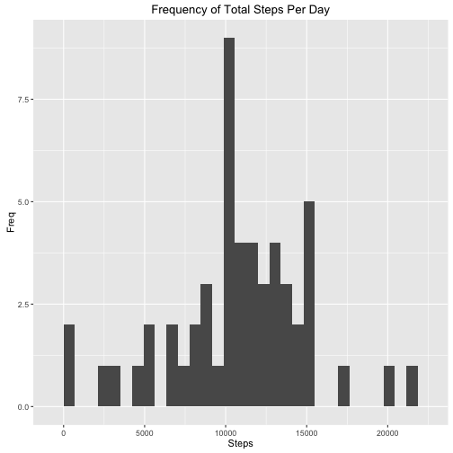
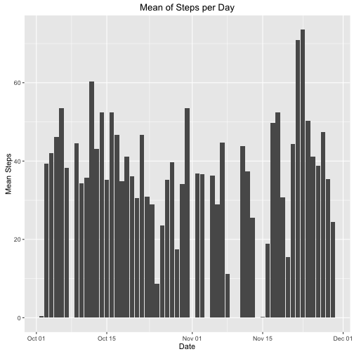
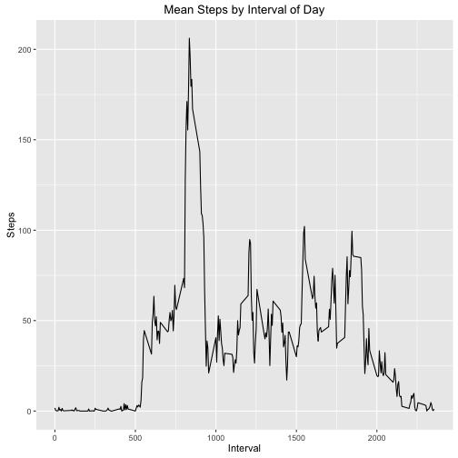
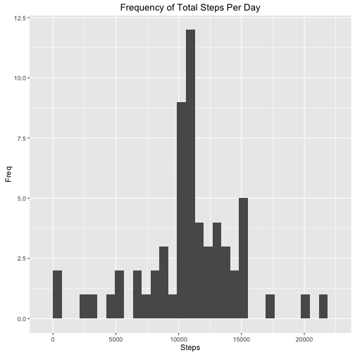
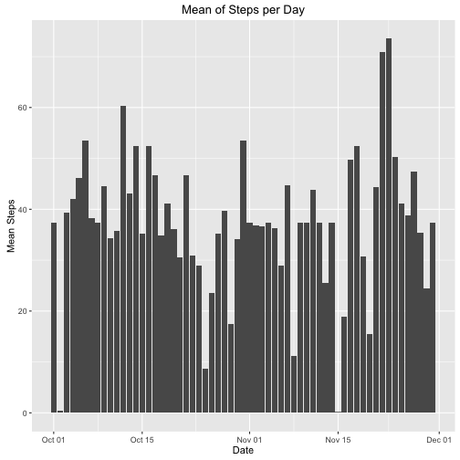
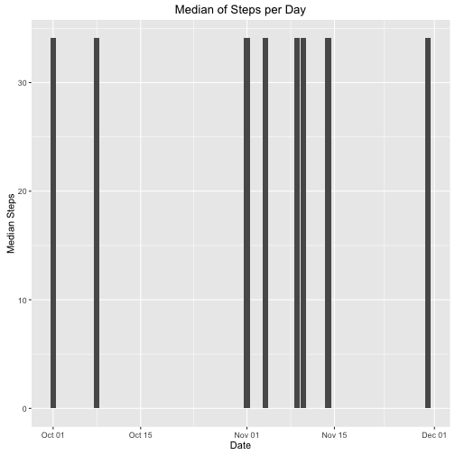
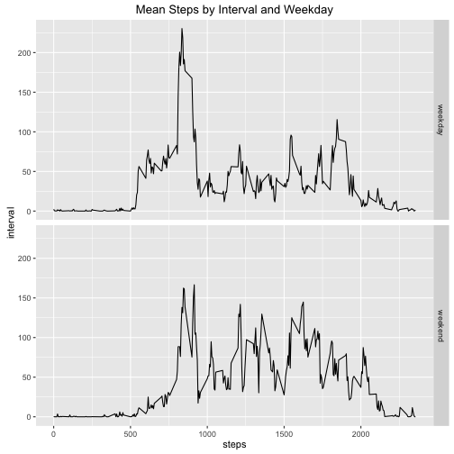

The assigment is based on the activity monitoring data set which measures steps for indivuals every five minutes for a two month period.

The code below imports the activity monitoring data set.


```r
setwd("~/Documents/DataScience/5_ReproducibleResearch/Assignment1")
library(ggplot2)
```

```
## Warning: package 'ggplot2' was built under R version 3.2.3
```

```r
library(dplyr)
```

```
## Warning: package 'dplyr' was built under R version 3.2.2
```

```
## 
## Attaching package: 'dplyr'
## 
## The following objects are masked from 'package:stats':
## 
##     filter, lag
## 
## The following objects are masked from 'package:base':
## 
##     intersect, setdiff, setequal, union
```

```r
activity <- read.csv("activity.csv", na.strings = "NA")
```

Next, I will add an addtional column called 'dt' which is a formatted date.

```r
activity$dt <- as.Date(as.character(activity$date))
```

Now, I will create a data set containing a summary of step activity at a date level.

```r
act_sum <- activity[complete.cases(activity),] %>% group_by(dt) %>% summarise(sum = sum(steps), mean = mean(steps), med = median(steps))
```

The histogram below reports the total steps per day for each day of the two month period.

```r
g1 <- ggplot(data = act_sum, aes(sum))
g1 + geom_histogram() + xlab("Steps") + ylab("Freq") + ggtitle("Frequency of Total Steps Per Day")
```

```
## `stat_bin()` using `bins = 30`. Pick better value with `binwidth`.
```

 

The table below reports a summary of total, mean, and median steps per day. It is clear from the summary that the median for each day is zero. A more detailed graph of daily means is below.

```r
summary(act_sum)
```

```
##        dt                  sum             mean              med   
##  Min.   :2012-10-02   Min.   :   41   Min.   : 0.1424   Min.   :0  
##  1st Qu.:2012-10-16   1st Qu.: 8841   1st Qu.:30.6979   1st Qu.:0  
##  Median :2012-10-29   Median :10765   Median :37.3785   Median :0  
##  Mean   :2012-10-30   Mean   :10766   Mean   :37.3826   Mean   :0  
##  3rd Qu.:2012-11-16   3rd Qu.:13294   3rd Qu.:46.1597   3rd Qu.:0  
##  Max.   :2012-11-29   Max.   :21194   Max.   :73.5903   Max.   :0
```

This graph reports the mean number of steps each day.

```r
g2 <- ggplot(data = activity[complete.cases(activity),], aes(dt, steps))
g2 + stat_summary(fun.y = mean, geom = "bar") + xlab("Date") + ylab("Mean Steps") +ggtitle("Mean of Steps per Day")
```

 

On average the 835th minute of each day has the highest number of steps.

```r
intervals <- activity %>% group_by(interval) %>% summarise(mean = mean(steps, na.rm = T))
filter(intervals, mean == max(mean))
```

```
## Source: local data frame [1 x 2]
## 
##   interval     mean
##      (int)    (dbl)
## 1      835 206.1698
```

```r
g3 <- ggplot(data = activity[complete.cases(activity),], aes(interval, steps))
g3 + stat_summary(fun.y = mean, geom = "line") + xlab("Interval") + ylab("Steps") + ggtitle("Mean Steps by Interval of Day")
```

 

The table below shows that there are 2,304 missing values from the data set.

```r
complete <- complete.cases(activity)
table(complete)
```

```
## complete
## FALSE  TRUE 
##  2304 15264
```

The code below will fill out all missing values from the data set by using the mean of the time inteval to fill the gap.

```r
activity_final <- activity %>% group_by(interval) %>% mutate(int_avg = mean(steps, na.rm = T))
activity_final <- activity_final %>% mutate(steps_final = ifelse(is.na(steps), int_avg, steps))
```

The following code will recalculate the total steps per day after missing values are filled.

Looking at the summary table, there is now an average median above zero. Across sum and mean it appears as though the min, max, mean, and median are unchanged. However, the 1st quartile is higher and the the 3rd quartile is lower. 

```r
act_sum_final <- activity_final %>% group_by(dt) %>% summarise(sum = sum(steps_final), mean = mean(steps_final), med = median(steps_final))
summary(act_sum_final)
```

```
##        dt                  sum             mean              med        
##  Min.   :2012-10-01   Min.   :   41   Min.   : 0.1424   Min.   : 0.000  
##  1st Qu.:2012-10-16   1st Qu.: 9819   1st Qu.:34.0938   1st Qu.: 0.000  
##  Median :2012-10-31   Median :10766   Median :37.3826   Median : 0.000  
##  Mean   :2012-10-31   Mean   :10766   Mean   :37.3826   Mean   : 4.474  
##  3rd Qu.:2012-11-15   3rd Qu.:12811   3rd Qu.:44.4826   3rd Qu.: 0.000  
##  Max.   :2012-11-30   Max.   :21194   Max.   :73.5903   Max.   :34.113
```

Here is a histogram showing the new daily step totals.

```r
g4 <- ggplot(data = act_sum_final, aes(sum))
g4 + geom_histogram() + xlab("Steps") + ylab("Freq") + ggtitle("Frequency of Total Steps Per Day")
```

```
## `stat_bin()` using `bins = 30`. Pick better value with `binwidth`.
```

 

This is a graph of the mean steps per day with NA's filled in.

```r
g5 <- ggplot(data = activity_final, aes(dt, steps_final))
g5 + stat_summary(fun.y = mean, geom = "bar") + xlab("Date") + ylab("Mean Steps") + ggtitle("Mean of Steps per Day")
```

 

The graph below shows the new median steps per day.

```r
g6 <- ggplot(data = activity_final, aes(dt, steps_final))
g6 + stat_summary(fun.y = median, geom = "bar") + xlab("Date") + ylab("Median Steps") + ggtitle("Median of Steps per Day")
```

 

The next block of code will add a flag specifying whether or not a day is a weekday or not.

```r
activity_final <- activity_final %>% mutate(weekday = as.factor(ifelse(weekdays(dt, abbreviate = F) %in% c("Sunday","Saturday"), "weekend", "weekday")))
```

It appears as though people walk a their most steps during weekday mornings, peaking around an average of 250 steps. However, throughout the rest of the weekday they walk far fewer steps. The average for the remainder of the day appears below 50 steps. On weekends people do not show a large peak in walking steps. They appear to walk about 100 steps throughout their day.


```r
g7 <- ggplot(data = activity_final, aes(y = steps_final, x = interval))
g7 + facet_grid(weekday ~ .) + stat_summary(fun.y = mean, geom = "line") + xlab("steps") + ylab("interval") + ggtitle("Mean Steps by Interval and Weekday")
```

 
